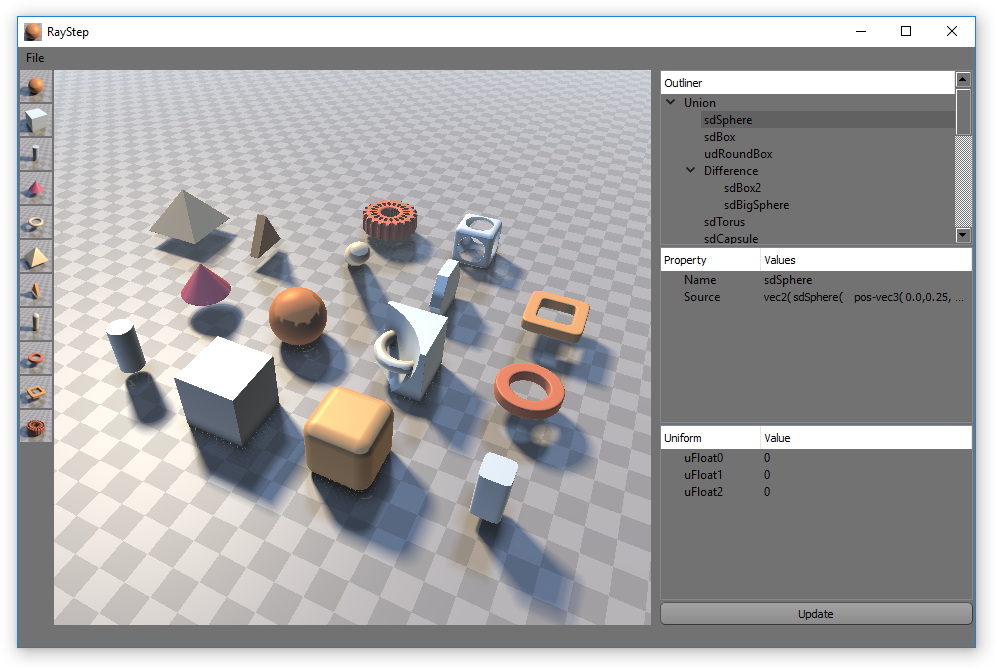

RayStep
=======

RayStep is a real-time 3D distance field modeling software. Its most immediate difference from traditional 3D modeling softwares is that it is not triangle-based. Even for the viewport rendering. It does not rely on the process of rasterization (the projection of geometry onto the camera's near frustum), and instead performs real time *ray marching*.

Demosceners and shader coders, as can be found in the [shadertoy](https://www.shadertoy.com/) community for instance, know well this technique, as the primary way of rendering 3D using only a fragment shader. The winners of last summers' shadertoy contest's last round even wrote [a nice illustration](https://www.shadertoy.com/view/4dSfRc) of the process (written itself using raymarching, so meta!) and [a walkthrough tutorial](https://www.shadertoy.com/view/MdBfRK) about how to make a ray marcher.

Because of its nature being so fundamentally different from rasterized 3D graphics, ray marched models enable a lot of powerful effects. Things which are hard to do with triangles became basic, like boolean operations, and on the contrary some things which were easy with triangles may have become trickier or computationally more expensive.

You can check out the [wonderful examples made by iq](http://www.iquilezles.org/www/articles/raymarchingdf/raymarchingdf.htm), and also many nice examples of landscapes that can be found [here](https://www.shadertoy.com/view/4slGD4) and [there](https://www.shadertoy.com/view/MlscWX) on shadertoy, featuring clouds and reflections and so on.

Since I wanted to play with all the nice possibilities that this enables, and also have non coders around me give it a shot, applying distortion with the mouse, structuring projects using distance field modeling, I started working on this GUI for ray marching rendering and associated modeling.

At this point, it is heavily based on Iñigo Quilez' demo [Raymarching - Primitives](https://www.shadertoy.com/view/Xds3zN), whose code has been released under the MIT license. It is more generally based on iq's work on [distance functions](http://www.iquilezles.org/www/articles/distfunctions/distfunctions.htm) and ray marching.

Build
-----

### Windows 64bit with Visual Studio 15 (2017)

Run `build-msvc15.bat`, then open `build-msvc15/RayStep.sln`.

### Other

	mkdir build
	cd build
	cmake .. # or e.g. cmake .. -G "MinGW" to use mingw
	make # or open generated solution (Visual Studio, XCode, etc.)

Usage
-----

It is still WIP. You can already play around and drag and drop items on the outliner panel, which describes the scene. You can select nodes in this tree and change their associated code (leaf nodes) or their associated operation (internal nodes, like Union and Difference). The source code of nodes relies on the predefined `pos` variable, the position at which the distance field is evaluated. It can also use variables from the Uniforms panel, whose value can be updated live. Whenever you edit the tree, you must press the Update button. Including the first time.

There is no load/save functionality. The current scene is hard-coded at the beginning of `src/RayStep/SceneTreeModel.cpp`. This is of course on of my major concerns, and why I do not consider this code as anything close to a release for now. I mainly share the code to show my interest.
